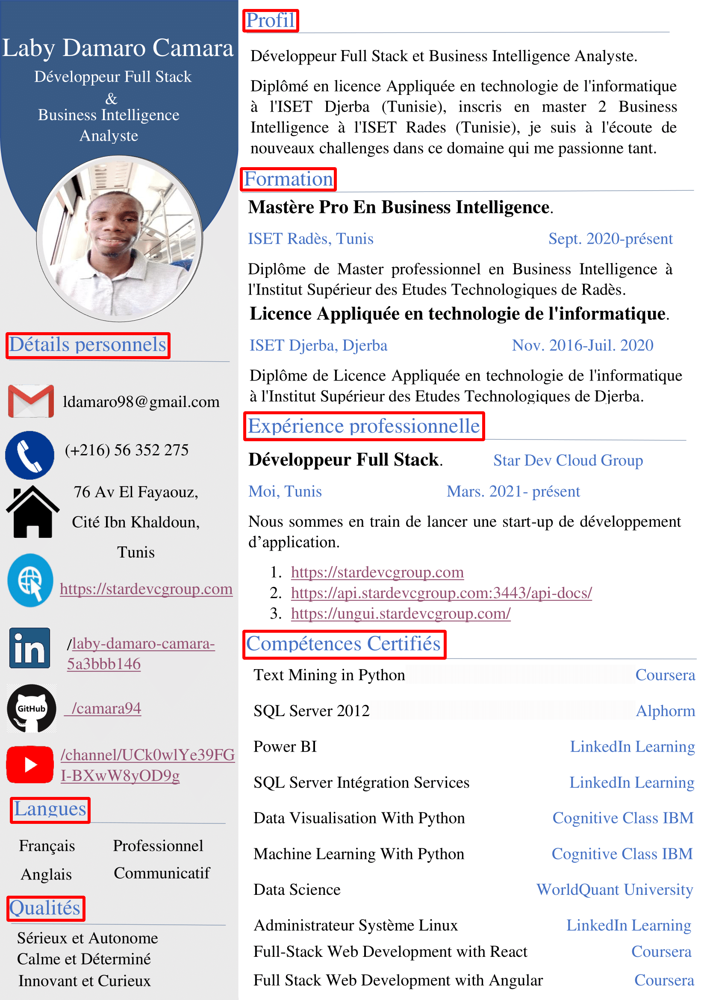

# Texte From Image

Dans ce tutoriel je vais utilisé la librairie EasyOCR qui est un projet open source de deep learning, qui permet d'extraire facilement du text à partir des images.

## Analyse de Mon CV
Je vais illustrer ce projet dans mon CV

## Lien Video

[https://youtu.be/gIjcO38lvx8](https://youtu.be/gIjcO38lvx8)

## Lien Util
